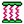

# ABQ_Matching

<p align="center">
  <a href="./README.md"></a>
  <a href="./README.en.md"></a>
  <a href="./LICENSE.md"></a>
</p>

ABQ_Matching is an **Abaqus/CAE node auto-matching plugin** for quickly creating connector wires or two-point springs between two node sets. It is intended for finite element modeling workflows such as bond-slip modeling, local interface connections, and node-to-node connection setup.

The plugin currently provides two tools:

- **Connector_Matching**: batch-matches two node sets and creates connector wires and wire sets.
- **Spring_Matching**: batch-matches two node sets and creates native Abaqus two-point springs.

The goal is to reduce repetitive manual modeling work. Users create two assembly-level node sets, and the plugin automatically pairs nodes using a nearest-neighbor strategy. The generated objects can then be edited further in Abaqus/CAE.

> This plugin handles node matching and connection-object creation only. It does not validate material behavior, boundary conditions, or convergence.

## Features

- Abaqus/CAE Plug-ins menu integration.
- Abaqus/CAE toolbar icon integration.
- Separate `Connector_Matching` and `Spring_Matching` entries.
- Shared GUI for model name, master set, slave set, and name suffix.
- All master nodes must be matched; slave nodes may remain unused.
- Slave-node occupancy check to prevent duplicate assignment.
- Automatic `_2`, `_3`, etc. suffixes when generated object names already exist.
- `Spring_Matching` creates native Abaqus `TwoPointSpringDashpot` objects.
- `Connector_Matching` creates connector wires and wire sets for later connector section assignment.

| Connector_Matching | Spring_Matching |
| --- | --- |
|  |  |

## Environment

The current version is primarily intended for:

- **Abaqus version**: Abaqus 2024
- **Python runtime**: Abaqus 2024 bundled Python 3
- **Install location**: Abaqus/CAE plugin directory
- **Node set type**: Assembly-level node sets

Abaqus versions older than 2024 commonly use Python 2, so GUI APIs, plugin registration, and script syntax may differ. These versions are not fully supported at the moment.

## Installation

Place the plugin folder in an Abaqus plugin directory, for example:

```text
E:\Abaqus2024\plugins\ABQ_Matching
```

The plugin folder should contain at least:

```text
ABQ_Matching_plugin.py
ABQ_MatchingDB.py
ABQ_Matching_kernel.py
connector.png
spring.png
```

After restarting Abaqus/CAE, the tools should appear under:

```text
Plug-ins > ABQ_Matching > Connector_Matching
Plug-ins > ABQ_Matching > Spring_Matching
```

Toolbar icons for connector and spring matching should also be visible.

The matching code first tries `scipy.spatial.cKDTree` for faster nearest-neighbor search. If SciPy is not available in the Abaqus Python environment, it falls back to pure Python distance calculations.

## Usage

### Inputs

- `Model-Name`: the Abaqus/CAE model name.
- `Set-Master`: the master node set. Every node in this set must be matched.
- `Set-Slave`: the slave candidate node set. Some nodes may remain unused.
- `Name suffix`: suffix used to distinguish generated objects.

### Basic workflow

1. Open the target model in Abaqus/CAE.
2. Create two assembly-level node sets: `Set-Master` and `Set-Slave`.
3. Click the plugin menu item or toolbar icon.
4. Enter the model name, node set names, and name suffix.
5. Click `OK`.
6. Inspect the generated objects in the model tree.
7. Define connector sections or spring parameters as required by the model.

### Matching logic

```text
Each master node searches for the nearest unused slave node.
All master nodes must be matched.
Slave nodes may remain unused.
One slave node cannot be assigned to multiple master nodes.
```

Use the smaller mandatory node group as the master set, and a larger candidate region as the slave set. If the slave node count is smaller than the master node count, the plugin stops with an error.

## Inputs and Outputs

### Inputs

The plugin requires:

- a valid Abaqus model;
- one assembly-level master node set;
- one assembly-level slave node set;
- a name suffix string.

### Connector_Matching outputs

`Connector_Matching` generates:

- connector wires;
- a wire set, for example `Connector_matching-1-WireSet`.

The current version does not automatically write a complete connector behavior. Users should define these in Abaqus/CAE:

- connector section;
- connection type, such as `Axial` or `Cartesian`;
- elasticity;
- orientation or local coordinate system;
- other connector behaviors.

### Spring_Matching outputs

`Spring_Matching` generates native Abaqus `TwoPointSpringDashpot` objects, visible under:

```text
Engineering Features > Springs/Dashpots
```

The default spring is intended as a placeholder and connection check. For nonlinear springs, edit the exported INP file, for example:

```inp
*Spring, elset=Springs/Dashpots-1-spring, nonlinear
```

Then add the required force-displacement data.

## Abaqus Test Workflow

This section describes the intended practical test flow. It is not a universal modeling recipe for any specific constitutive law.

### Demo goals

- Match two node sets using nearest-neighbor matching.
- Batch-create spring elements with `Spring_Matching`.
- Batch-create connector wires with `Connector_Matching`.
- Inspect generated objects and results in Abaqus/CAE.

### Required model

The demo requires an existing Abaqus model with:

- a master node set for matching;
- a slave candidate node set;
- required materials, sections, boundary conditions, and analysis steps.

### Steps

1. Open the Abaqus/CAE model.
2. Confirm both node sets are assembly-level sets.
3. Run `Spring_Matching` or `Connector_Matching`.
4. Enter `Model-Name`, `Set-Master`, `Set-Slave`, and `Name suffix`.
5. Click `OK`.
6. Define required properties for springs or connectors.
7. Submit the job.
8. Open the result file and inspect deformation, stress, and connection behavior.

### Notes

- Generated connection objects only show that batch creation works; stiffness and constitutive behavior must be validated for each model.
- Connector objects need connector sections and behavior definitions, or Abaqus may report missing properties.
- If the INP contains `*Conflicts`, it usually means manual Keywords Editor edits conflict with Abaqus/CAE GUI edits.
- For complex bond-slip models, validate the connection setup on a small model before adding nonlinear behavior.

## Limitations

### Scope

The plugin is intended for batch creation of connections between two node sets, such as:

- bond-slip modeling between rebar and concrete;
- interface connections between steel plates, steel tubes, steel sections, concrete, or UHPC;
- connections between solid rebars, studs, connectors, and concrete;
- node matching between steel structures and concrete components.

It does not automatically generate full material behavior or validate connection parameters.

### Input limitations

- `Set-Master` and `Set-Slave` must be assembly-level node sets.
- Neither set can be empty.
- `Set-Slave` must contain at least as many nodes as `Set-Master`.
- All master nodes must be matched.
- Slave nodes may remain unused but cannot be reused.

### Abaqus version limitations

The current tested environment is Abaqus 2024. Older versions may require adaptation because of Python, GUI registration, icon loading, or kernel-call differences.

### Matching limitations

The current algorithm uses KDTree or pure Python nearest-neighbor candidate search with greedy occupancy assignment. It is efficient and practical, but it is not a global optimal matching algorithm.

Possible issues:

- local nearest-neighbor matching may not minimize total global distance;
- highly nonuniform node distributions require manual inspection;
- long master-slave distances may be mathematically matched but physically unreasonable.

### Common failure cases

- incorrect model name;
- incorrect node set name;
- node sets are not assembly-level sets;
- slave node count is smaller than master node count;
- connector section has no behavior definition;
- `*Conflicts` exists in the Keywords Editor state;
- direct connector connections between solid nodes cause overconstraint, orientation, or convergence issues.

## Version

### Current version: v1.0.1

Supported:

- Abaqus/CAE Plug-ins menu registration;
- Abaqus/CAE toolbar icon registration;
- `Connector_Matching` GUI;
- `Spring_Matching` GUI;
- master/slave node set reading;
- nearest-neighbor node matching;
- slave-node occupancy check;
- automatic name suffixing;
- batch two-point spring creation;
- batch connector wire and wire set creation;
- basic cleanup of legacy plugin keyword blocks and `*Conflicts`.

### Not supported yet

- nonlinear spring force-displacement input in the GUI;
- complex connector behavior input in the GUI;
- automatic validation of connector section behavior;
- automatic repair of all Abaqus/CAE Keywords Editor conflicts;
- global Hungarian optimal matching;
- one-to-many connections;
- automatic convergence validation.

## Roadmap

- Add optional matching distance limits.
- Export matching distance statistics.
- Add spring/connector rebuild or cleanup helpers.
- Improve error messages.
- Test more Abaqus versions.

## License

See [LICENSE.md](./LICENSE.md).
