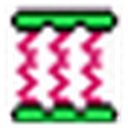
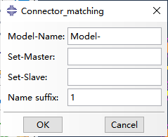
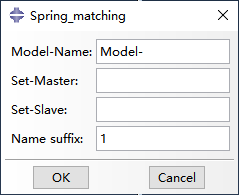
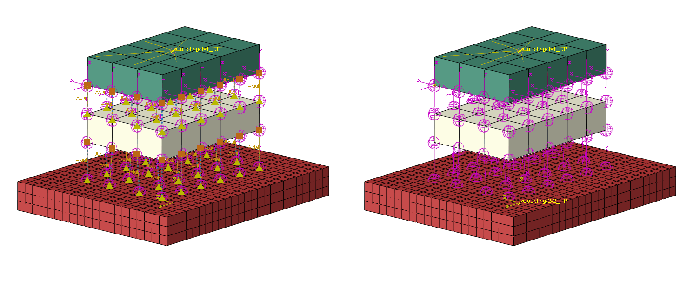
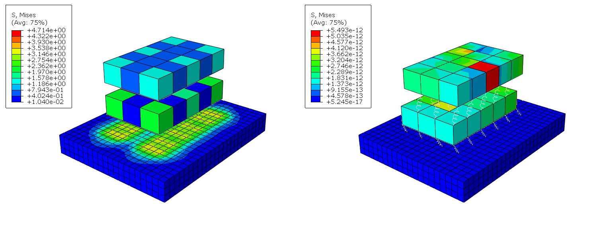

# ABQ_Matching

<p align="center">
  <a href="./README.md"></a>
  <a href="./README.en.md"></a>
  <a href="./LICENSE.md"></a>
</p>

ABQ_Matching 是一个用于 **Abaqus/CAE 节点自动匹配建模** 的插件工具，主要用于快速创建两组节点之间的连接器连接线或两点弹簧单元，适合粘结滑移、局部界面连接和节点连接等有限元建模场景。

插件目前包含两个入口：

- **Connector_Matching**：批量匹配两组节点并创建 connector wire 和 wire set。
- **Spring_Matching**：批量匹配两组节点并创建 Abaqus 原生 two-point spring。

插件的核心目标是减少重复手动建模：用户提前建立两个 assembly 级节点集，插件根据最近邻算法自动完成节点配对，并生成可在 Abaqus/CAE 中继续编辑的连接对象。

> 本插件主要负责“节点匹配”和“连接对象创建”，不自动判断材料本构、边界条件或模型收敛性是否合理。

## 功能特点

- 支持 Abaqus/CAE Plug-ins 菜单调用。
- 支持 Abaqus/CAE 工具栏图标调用。
- 提供 `Connector_Matching` 和 `Spring_Matching` 两个独立入口。
- 使用统一 GUI 输入模型名、主节点集、从节点集和对象名称后缀。
- master 节点必须全部匹配，slave 节点允许剩余。
- slave 节点带占用检查，避免同一个 slave 节点重复分配。
- 同名对象自动追加 `_2`、`_3` 等后缀，避免覆盖已有对象。
- `Spring_Matching` 生成 Abaqus 原生 `TwoPointSpringDashpot`。
- `Connector_Matching` 生成 connector wire 和 wire set，便于后续分配 connector section。

| Connector_Matching | Spring_Matching |
| --- | --- |
|  |  |

## 使用环境

当前版本主要面向以下环境：

- **Abaqus 版本**：Abaqus 2024
- **Python 环境**：Abaqus 2024 自带 Python 3
- **运行位置**：Abaqus/CAE 插件目录
- **节点集类型**：Assembly 级节点集

Abaqus 2024 以下版本通常仍以 Python 2 为主，GUI API、插件注册方式和脚本语法可能存在差异。当前版本未对 Abaqus 2024 以下版本进行完整适配。

## 安装与依赖

将插件文件夹放入 Abaqus 插件目录，例如：

```text
E:\Abaqus2024\plugins\ABQ_Matching
```

插件目录应至少包含：

```text
ABQ_Matching_plugin.py
ABQ_MatchingDB.py
ABQ_Matching_kernel.py
connector.png
spring.png
```

启动 Abaqus/CAE 后，应能在以下位置看到插件：

```text
Plug-ins > ABQ_Matching > Connector_Matching
Plug-ins > ABQ_Matching > Spring_Matching
```

工具栏中也会出现 connector 和 spring 图标。

算法部分优先尝试使用 `scipy.spatial.cKDTree` 加速最近邻搜索；如果 Abaqus Python 环境没有 SciPy，会自动退回纯 Python 距离计算。

## 使用方法

GUI 界面如下：

| Connector_Matching | Spring_Matching |
| --- | --- |
|  |  |

### 输入参数

- `Model-Name`：Abaqus/CAE 中的模型名称。
- `Set-Master`：主节点集，集合内所有节点都必须完成匹配。
- `Set-Slave`：从节点集，作为候选匹配节点，可以存在剩余节点。
- `Name suffix`：对象名称后缀，用于区分不同批次生成的连接对象。

### 基本步骤

1. 在 Abaqus/CAE 中打开目标模型。
2. 在 Assembly 层创建两个节点集：`Set-Master` 和 `Set-Slave`。
3. 点击插件菜单或工具栏图标。
4. 输入模型名、节点集名称和名称后缀。
5. 点击 `OK` 执行。
6. 在模型树中检查生成对象。
7. 根据模型需求继续定义 connector section 或 spring 参数。

### 匹配逻辑

```text
每个 master 节点寻找最近的未占用 slave 节点
master 节点必须全部匹配
slave 节点允许剩余
一个 slave 节点不会重复分配给多个 master 节点
```

推荐将 master 集合设置为需要全部连接的少量节点，将 slave 集合设置为候选区域中的较多节点。如果 slave 节点数量少于 master 节点数量，插件会停止并提示错误。

## 输入输出说明

### 输入

插件需要用户提前准备：

- 一个有效的 Abaqus model。
- 一个 assembly 级 master 节点集。
- 一个 assembly 级 slave 节点集。
- 一个用于命名的后缀字符串。

### Connector_Matching 输出

`Connector_Matching` 会根据匹配结果生成：

- connector wire
- wire set，例如 `Connector_matching-1-WireSet`

当前版本不自动写入完整 connector behavior。用户需要在 Abaqus/CAE 中继续定义：

- connector section
- connection type，例如 `Axial`、`Cartesian`
- elasticity
- 方向或局部坐标系
- 其他连接器行为

### Spring_Matching 输出

`Spring_Matching` 会生成 Abaqus 原生 `TwoPointSpringDashpot`，可在模型树中查看：

```text
Engineering Features > Springs/Dashpots
```

默认弹簧用于占位和检查连接关系。若需要非线性弹簧，可在写出 INP 后进一步编辑：

```inp
*Spring, elset=Springs/Dashpots-1-spring, nonlinear
```

并补充对应的力-位移数据。

## Abaqus 实机测试流程

本节说明插件的基本运行流程和结果检查方式，不代表某一类本构模型的唯一建模方法。

### 演示目标

- 使用两组节点集进行最近邻匹配。
- 通过 `Spring_Matching` 批量创建弹簧单元。
- 通过 `Connector_Matching` 批量创建 connector wire。
- 在 Abaqus/CAE 中检查生成对象和计算结果。

### 输入文件

下面演示的是一个已经建立好的 Abaqus 模型作为测试，模型中至少包含：

- 可用于匹配的 master 节点集。
- 可用于搜索的 slave 节点集。
- 必要的材料、截面、边界条件和分析步。

模型预览：



### 执行步骤

1. 打开 Abaqus/CAE 模型。
2. 确认两个节点集均位于 Assembly 层。
3. 执行 `Spring_Matching` 或 `Connector_Matching`。
4. 输入 `Model-Name`、`Set-Master`、`Set-Slave` 和 `Name suffix`。
5. 点击 `OK` 生成连接对象。
6. 对 spring 或 connector 继续设置必要属性。
7. 提交 job。
8. 打开结果文件检查变形、应力和连接效果。

### 注意事项

- 演示中的连接对象只说明插件可以完成批量创建，不代表具体刚度或本构适用于所有模型。
- connector 需要额外定义 connector section 和 behavior，否则可能出现 property 缺失错误。
- 如果 INP 中出现 `*Conflicts`，通常说明 Keywords Editor 中的手动编辑与 Abaqus/CAE GUI 修改发生冲突。
- 对于复杂粘结滑移模型，建议先用小模型验证连接关系，再引入非线性本构。

### 结果预览与视频

计算结果预览：



演示视频：

- [Spring_Matching 演示视频](./assets/readme/spring_demo.mp4)
- [Connector_Matching 演示视频](./assets/readme/connector_demo.mp4)

## 限制

### 适用范围限制

当前插件适用于需要批量创建两组节点之间连接关系的场景，例如：

- 钢筋与混凝土之间的粘结滑移建模。
- 钢板、钢管、钢骨与混凝土或 UHPC 的界面连接。
- 实体钢筋、栓钉、连接件与混凝土之间的连接。
- 层间隔震或钢结构与混凝土之间的节点匹配。

插件不负责自动生成完整材料本构，也不负责自动判断连接参数是否合理。

### 输入数据限制

- `Set-Master` 和 `Set-Slave` 必须是 Assembly 级节点集。
- 两个节点集不能为空。
- `Set-Slave` 节点数必须大于等于 `Set-Master` 节点数。
- master 节点必须全部匹配。
- slave 节点可以剩余，但不能被重复占用。

### Abaqus 版本限制

当前主要测试环境为 Abaqus 2024。Abaqus 2024 以下版本未完整适配，可能存在 Python 版本、GUI 注册、图标加载和 kernel 调用差异。

### 匹配算法限制

当前匹配算法是 KDTree 或 Python 最近邻候选搜索配合贪心占用分配。它强调效率和工程可用性，但不是全局最优匹配算法。

可能出现的情况：

- 局部最近邻结果不一定是全局总距离最小。
- 节点分布非常不均匀时，匹配结果需要人工检查。
- master/slave 节点距离过大时，虽然可以生成连接，但物理意义可能不合理。

### 可能失败的情况

- 模型名输入错误。
- 节点集名称输入错误。
- 节点集不是 Assembly 级节点集。
- slave 节点数少于 master 节点数。
- connector section 未定义 behavior。
- Keywords Editor 中存在 `*Conflicts`。
- connector 直接连接实体节点后出现过约束、局部方向或收敛问题。

### 使用前建议

正式计算前建议检查：

- 生成连接数量是否等于 master 节点数量。
- 连接线或弹簧位置是否符合预期。
- connector section 是否完整定义。
- spring 方向和刚度是否符合模型单位体系。
- INP 中是否存在 `*Conflicts`。
- 小模型验证通过后再扩展到大模型。

## 版本说明

### 当前版本：v1.0.1

当前版本已支持：

- Abaqus/CAE 插件菜单注册。
- Abaqus/CAE 工具栏图标注册。
- `Connector_Matching` GUI。
- `Spring_Matching` GUI。
- master/slave 节点集读取。
- 最近邻节点匹配。
- slave 节点占用检查。
- 同名对象自动追加后缀。
- two-point spring 批量创建。
- connector wire 和 wire set 批量创建。
- 旧版插件 keyword 残留和 `*Conflicts` 的基础清理。

### 当前未支持

- 在 GUI 中输入 spring 非线性力-位移曲线。
- 在 GUI 中输入 connector 复杂本构。
- 自动判断 connector section 是否物理合理。
- 自动修复 Abaqus/CAE Keywords Editor 中所有冲突状态。
- 全局 Hungarian 最优匹配。
- 一点对多点连接。
- 自动判断模型是否能收敛。

## 后续计划

- 增加匹配结果预检查或距离统计导出。
- 增加用户可选的最大连接距离。
- 增加 spring/connector 对象删除或重建辅助工具。
- 增加更明确的错误提示。
- 增加更多 Abaqus 版本兼容性测试。

## 许可证说明

许可证见 [LICENSE.md](./LICENSE.md)。
